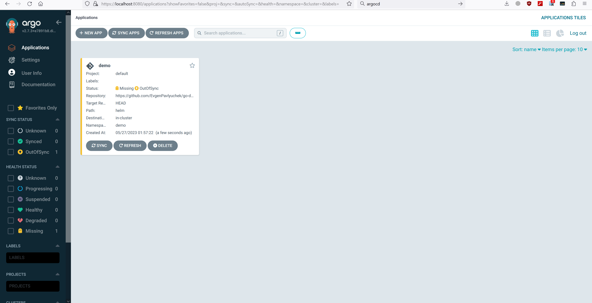
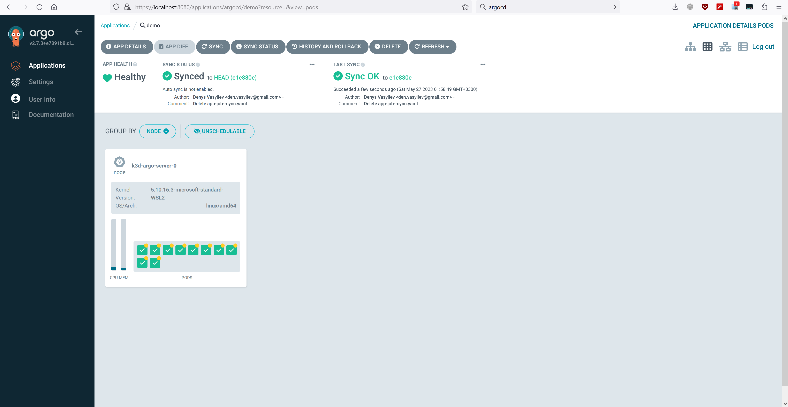

# Automatically Deploying Application to Kubernetes with ArgoCD

## Installation k3d and ArgoCD

Repeat steps from the previous DOC file https://github.com/EvgenPavlyuchek/AsciiArtify/blob/main/doc/POC.md

## Deploying Application with ArgoCD

Creating App Via ArgoCD UI with the following repo https://github.com/EvgenPavlyuchek/go-demo-app

## Tune app in order to check Syncing via UI

## Checking the application using CLI

    kubectl port-forward svc/ambassador -n demo 8088:80
    wget -O /tmp/g.png https://www.pngmart.com/files/12/Funny-Kolobanga-PNG-Background-Image.png
    curl -F 'image=@/tmp/g.png' localhost:8088/img/

Demo link: https://asciinema.org/a/587761