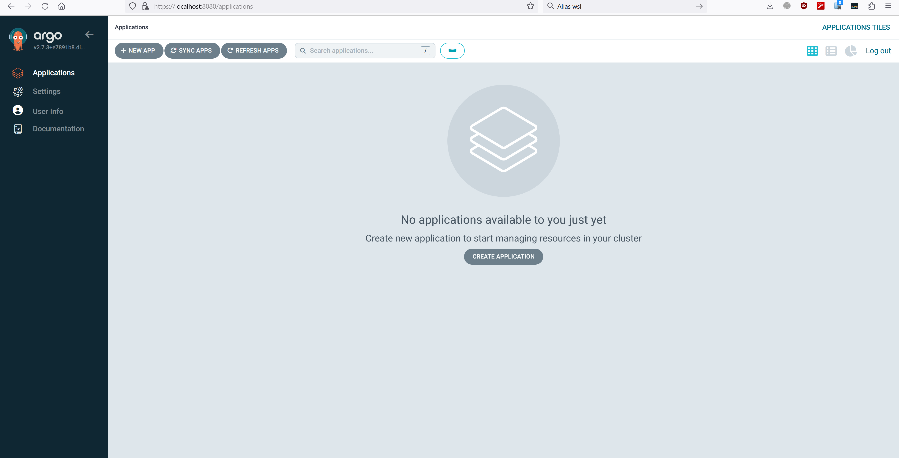

# Proof of Concept (PoC) deployment ArgoCD into Kubernetes Cluster k3d

## Requirements
- k3d installed
- kubectl installed

## Installation

1.1 Create a k3d cluster by running the following command:
   
   ```
   k3d cluster create my-cluster
   ```

1.2 Сreate AgroCD namespace 'argocd':

   ```
   kubectl create namespace argocd
   kubectl apply -n argocd -f https://raw.githubusercontent.com/argoproj/argo-cd/stable/manifests/install.yaml
   ```

1.3 To access the ArgoCD web interface, use Port Forwarding:

   ```
   kubectl port-forward svc/argocd-server -n argocd 8080:443
   ```

1.4 Open a web browser and login to `https://localhost:8080` with admin and password, using following command

   ```
   kubectl -n argocd get secret argocd-initial-admin-secret -o jsonpath="{.data.password}" | base64 -d; echo
   ```

## Configuration

2.1 Open a web browser and login to `https://localhost:8080` with admin and password, using following command

   ```
   kubectl -n argocd get secret argocd-initial-admin-secret -o jsonpath="{.data.password}" | base64 -d; echo
   ```

2.2 Use web interface to view the status of your applications and repositories, manage clusters, settings and user accounts 



## Demo


Demo link: https://asciinema.org/a/587549